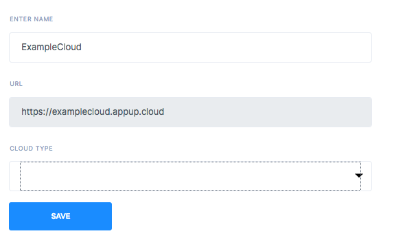
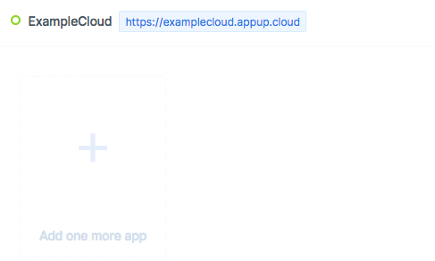

# Getting Started
Welcome to Appup documentation. You can learn how to use Appup with simple steps if you follow this guide thoroughly. Feel free to suggest improvements if you find any of these topics hard to grasp. 

Appup is engineered to let you publish production grade applications without needing to write a single piece of code. Ofcourse, it is within the features of Appup to run your own code if you'd like to. 

Appup gets your apps hit the market faster, is easy-to-use, helps you get things right the first time, and above all, cost-effective.

---

To get started with using Appup, you first need to create a **Cloud**. A cloud is a container to store all your applications. Creating a cloud is an easy, often one time only task.

---

You need to choose a name for your cloud, this can be your company name.

You must also choose where to host the app software.

---

Once you create your cloud, you are ready to create your first app. Click the big **+** button to start providing details. You can give a name to your app as well as choose a logo picture. Take a note of the provided URL for your app. It will be useful in the future.

---

You are ready to implement your business logic. :tada:
