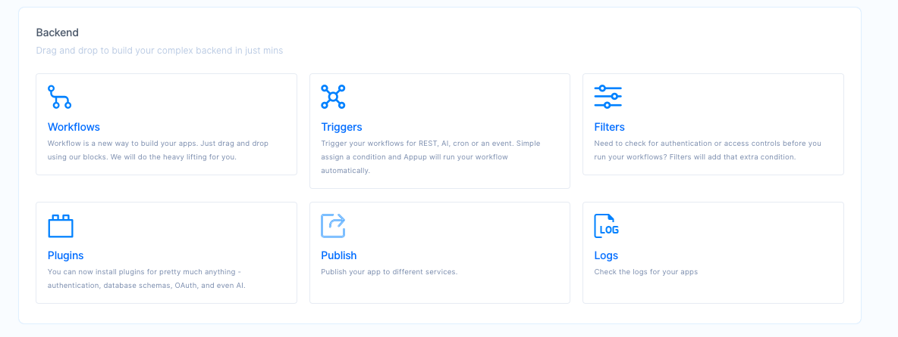

# Backend-as-a-service
Traditionally any web application has a presentation layer, the frontend and a data access layer, the backend. The modular architecture of Appup allows you to define the individual elements of each independently and connect them together basis the use case at any time later. This flexiblity allows you to efficiently handle any change requests in your application later and with minimal turn-around time.
You will learn how to use backend features to realize your business logic here.

The main toolset we are going to use consists of **Workflows**, **Triggers** and **Filters**. You are also going to be able to utilize numerous **Plugins** to extend capabilities of builtin workflows steps.

Let us take a quick look at each of them with an example

Triggers: Triggers correpond to the specific events that must be handled by executing the respective business logic. 
Consider an e-commerce app. Here, the common use-cases are customer placing an order, querying for availability etc. Each of these requests can be classified as a trigger point.

Workflow: It is the business logic that needs to be executed at the occurrence of specific business events. 
Lets pick one use case from the previous ones discussed. For instance, placing an order of an item from the store. Here, the business logic would be as follows:
a. Check availability of the item in the inventory
b. Send status to the customer
c. Check customer balance in wallet
d. Take customer order
All these steps can be incorporated in the business logic attached to the event trigger above.

Filters: Filters are, in-short, actions that must be run before or after the workflow steps are executed for the respective business events. They are associated to the same expressions that are mapped to the respective triggers/worflows.

Coming to the example above, consider that for all customers satisfying a particular demographic we want to provide specific discounts. This conditional logic for a filtered set of customers can be taken care of using filters.

Plugins: They are hooks provided into the latest technologies and can be used out of the box to enable integration with diverse third party products having different underlying technologies.
In our example earlier, most of the different individual steps of the use case involve accessing the database. This database can be easily setup using a plugin. Subsequent use of the DB does not require any further modifications to the app.
