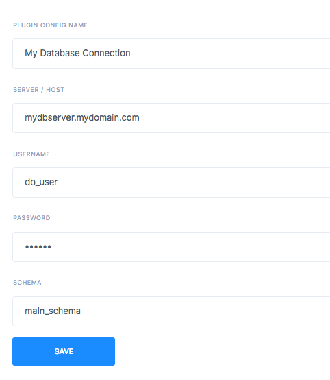

# Plugins
Plugins are, in short, hooks into other technologies and commercially available off-the-shelf products. These are integration points which allow the user to seamlessly connect to other third party technologies.
They are based on a Write-once Run-anywhere type of architecture, thereby giving you economies of scale. Install or create a plugin for one use case and use it across multiple applications and technology stacks. You are no longer limited by skills-gap or burdened by writing and testing the same code multiple times. Appup will take care of the integration for you.

Appup comes with lots of plugins to extend workflow functionalities. You can checkout the Market Place to find the plugin of your needs. The plugin architecture allows anyone to implement his/her own plugin in a modular manner. At the time of this is being written, there are plugins already available to connect to MySQL, Redis, 3rd Party login systems, Kafka and many other. Installing a plugin is a simple matter of configuring what is requested by the plugin.
Use plugins to couple with IOT, AI, RPM and more.

#### Here is what you should see when you click a plugin


---
## Database
A database plugin allows you to tap into and integrate with a database of your choice. By installing a database plugin, your workflows can run queries on the configured database.

### MySQL
Installing a MySQL plugin populates the dropdown under SQL workflow steps with a database you provide. You can connect as many databases you want. Simple install multiple plugins if you desire.

| Fields             | Description                                                          |
| ------------------ | -------------------------------------------------------------------- |
| Plugin Config Name | Choose a name to easily recognize your plugin inside workflow editor |
| Server / Host      | Server url of your db instance                                       |
| Username           | Username for db connection                                           |
| Password           | Password for db connection                                           |
| Schema             | Main schema to run your queries                                      |

### Redis
You can also connect to a redis instance if your configure the plugin accordingly. Your workflows will be able to set and retrieve values with corresponding steps.

---
## AWS

### S3

### SNS

### SES Email

### Serverless Lambda

---
## Event

### Kafka Producer

---
## JWT

### JWT Signing and Verifying

---
## OAuth

### Google OAuth

### Github OAuth

### Twitter OAuth

### LinkedIn OAuth

### Aweber OAuth

### Automtic OAuth

### Dataporten OAuth

### Etsy OAuth

### Genius OAuth

### HiOrdServer OAuth

### Imgur OAuth

### Kaixin001 OAuth

### Mailru OAuth

### MediaWiki OAuth

### Misfit OAuth

### Naver OAuth

### Pinterest OAuth

### Trello OAuth

### Frappe OAuth

### Facebook OAuth

### Digg OAuth

### Head Hunter OAuth

---
## Code - Create your own Plugins
It is possible to create custom plugins for tailored use cases. Plugins are currently developed in Java or Javascript via extending simple classes for custom behavior. In order to add a custom code plugin, navigate to **Plugins** and select one of the available code plugins. You will be asked for working business code in the presented screen.

You also have the luxury of extending any of the existing plugins to different horizontals & industries and thus exponentially increasing the use cases handled by the core functionality.

### Java
Below is an example of a custom plugin where the plugin communicates with AWS S3.

You must extend `Plugin` to define configuration parameters of your plugin.
```Java
import com.appup.core.plugin.Plugin;
import lombok.Getter;
import lombok.Setter;

/**
* Plugin Configuration class for the AWS S3
*/
@Setter
@Getter
@com.appup.core.annotation.Plugin(
  type = "s3-plugin",
  name = "S3 Bucket",
  category = "storage",
  executor = S3BucketPlugInHandler.class
)
public class S3BucketPlugIn extends Plugin {
  String accessKey;
  String secretKey;
  String region;
}
```

Once you define parameters for your plugin interface, they will be ready to be shown to the user.

The main logic is executed in the `executor` class you provide to your `@com.appup.core.annotation.Plugin` annotation, namely `S3BucketPlugInHandler` in this example.

Plugin handlers are implemented by conforming to the `PluginHandler<P extends Plugin, O>` interface.

```java
class MyS3Plugin implements PluginHandler<MyS3Plugin, ServiceBuilder> {
  @Override
  public void init(TwitterOauthPlugin pluginConfig) {
    config = pluginConfig;
    service = new ServiceBuilder(config.getKey()).apiSecret(config.getSecret());
    config.setOauth_version("1");
  }

  @Override
  public ServiceBuilder get() {
    return service;
  }

  @Override
  public boolean destroy() {
    return true;
  }
}
```

We are now ready to use our plugin inside workflows as a custom step. Multiple steps can refer to the same plugin, so we implement **Steps** to make use of our plugin configuration. Below is a simple step implementation which uploads a file to AWS S3. In order to create a custom step that make use of a plugin, we inherit from `Step` like presented below.

```Java
import com.amazonaws.services.s3.AmazonS3Client;
import com.amazonaws.services.s3.model.CannedAccessControlList;
import com.amazonaws.services.s3.model.ObjectMetadata;
import com.appup.core.config.workflow.steps.Step;
import com.appup.core.constants.StepStatus;
import com.appup.core.constants.StepType;
import com.appup.core.workflow.step.Context;
import com.appup.core.workflow.step.executor.StepExecutor;
import com.appup.workflows.external.plugins.aws.s3.S3BucketPlugInHandler;
import lombok.Getter;
import lombok.NoArgsConstructor;
import lombok.Setter;
import lombok.extern.slf4j.Slf4j;

import java.io.ByteArrayInputStream;
import java.io.InputStream;
import java.util.Map;

/**
 * S3FileUploadStepExecutor is used to Upload the files into given S3 location and return a URL for the uploaded file.
 */
@Slf4j
@Getter
@Setter
@NoArgsConstructor
@com.appup.core.annotation.Step(type = StepType.S3_FILE_UPLOAD, executor = S3FileUploadStepExecutor.class, ui = "")
public class S3FileUploadStepExecutor extends Step implements StepExecutor<S3FileUploadStepExecutor> {
  String file_name;
    String file_data;
    String output_variable;
    String bucket_name;
    String content_type;
    String value_type;
    String file_access;
  private String plugin_name;

  /**
   * @param step
   * @param map
   * @param context
   * @return
   * @throws Exception
   */
  @Override
  public String execute(S3FileUploadStepExecutor step, Map map, Context context) throws Exception {
    log.info("S3PreSignURLStepExecutor");


    String contentType = step.getContent_type();
    if (contentType == null || contentType.isEmpty()) {
      // If no content type is set then fallback to what AWS defaults to.
      contentType = "binary/octet-stream";
    }
    // get s3 bucket plugin
    S3BucketPlugInHandler s3BucketPlugInExecutor = (S3BucketPlugInHandler) context.getPluginManager().getPluginByName(step.getPlugin_name());

    //added for unit testing.
    //final AmazonS3Client s3client = (AmazonS3Client)map.get("plugin");

    final AmazonS3Client s3client = s3BucketPlugInExecutor.get();
    ObjectMetadata meta = new ObjectMetadata();
    meta.setContentLength(map.get(step.getFile_data()).toString().getBytes().length);
    meta.setContentType(contentType);

    byte[] data = (map.get(step.getFile_data())).toString().getBytes();
    InputStream stream = new ByteArrayInputStream(data);
    s3client.putObject(step.getBucket_name(), step.getFile_name(), stream, meta);
    s3client.setObjectAcl(step.getBucket_name(), step.getFile_name(), CannedAccessControlList.valueOf(step.file_access));
    String url = s3client.getResourceUrl(step.getBucket_name(), step.getFile_name());

    map.put(step.getOutput_variable(), url);
    log.info("Uploaded S3  file URL = " + url);
    return StepStatus.SUCCESS;
  }
}
```

### Javascript
It is also possible to write plugins in Javascript. Simply write Javascript in the provided box and enjoy to access your variables inside a Javascript code step in **Workflows**.
