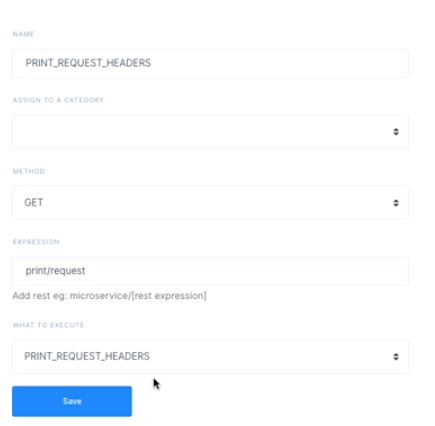

# Triggers
Triggers are the different points at which appup executes the workflow logic. They trigger the business logic by invoking the workflow. Any event or action that needs to be handled by running specific business logic can be mapped against the respective workflow. The things that stands out here is the variety of use cases that can be covered by a single workflow by having multiple triggers of different types. Consider a few examples:
1. A customer makes a new friend on Facebook and the business looks at her as a lead? Great ! Absolutely no problem. Just create a trigger to invoke the business logic containing workflow through an asyncrhonous EVENT trigger.
2. The customer has just logged on to your website and made a transaction. He qualifies for your promotional discount? Simple. Use a REST trigger

Triggers available are of three types : REST, CRON and Event. You can decide the type of trigger to be created based on the frequency with which it is to be invoked, its privacy and the ease with which it can be used.
## REST
These triggers invoke workflows when a specific URL is requested with an HTTP call. It supports different HTTP methods like GET, POST, PUT etc and can parse url/path parameters for workflows to inspect.

When you define a path expression for your trigger, you may use `path/{myVariable}` pattern to automatically capture any request of the same pattern where `myVariable` is filled with whatever sent from the client. Your workflows then can inspect the content of the variable as if it is set by a **SetVar** step.

## CRON
These triggers invoke workflows when a specific amount of time passes periodically. You can define the expression that sets the period as documented under [Cron Expressions](https://docs.oracle.com/cd/E12058_01/doc/doc.1014/e12030/cron_expressions.htm).

## EVENT
These triggers invoke workflows when a specific event is emitted by one of your workflows. This is the way one workflow triggers the other, thus propagating multiple flows on paralel pipelines.
