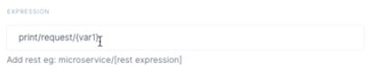

# Triggers
Triggers are the different points or actions/events that executes the workflow logic.

Just like workflows, triggers are also categorized.

## REST
These triggers invoke workflows when a specific URL is requested with an HTTP call. It supports verbs like GET, POST, PUT etc and can parse url/path parameters for workflows to inspect.

When you define a path expression for your trigger, you may use `path/{myVariable}` pattern to automatically capture any request of the same pattern where `myVariable` is filled with whatever sent from the client. Your workflows then can inspect the content of the variable as if it is set by a **SetVar** step.

## CRON
These triggers invoke workflows when a specific amount of time passes periodically. You can define the expression that sets the period as documented under [Cron Expressions](https://docs.oracle.com/cd/E12058_01/doc/doc.1014/e12030/cron_expressions.htm).

## EVENT
These triggers invoke workflows when a specific event is emitted by one of your workflows. This is the way one workflow triggers the other, thus propagating multiple flows on paralel pipelines.
