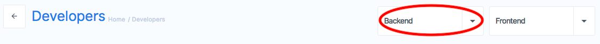
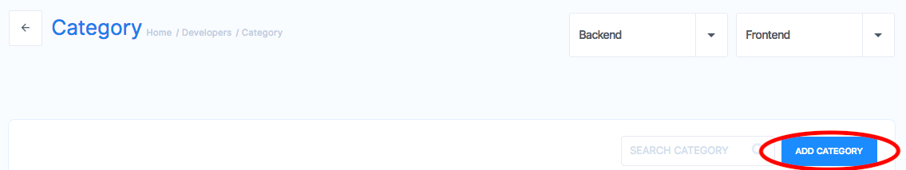
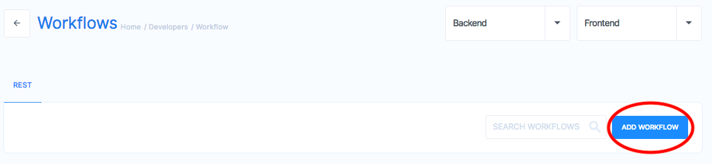
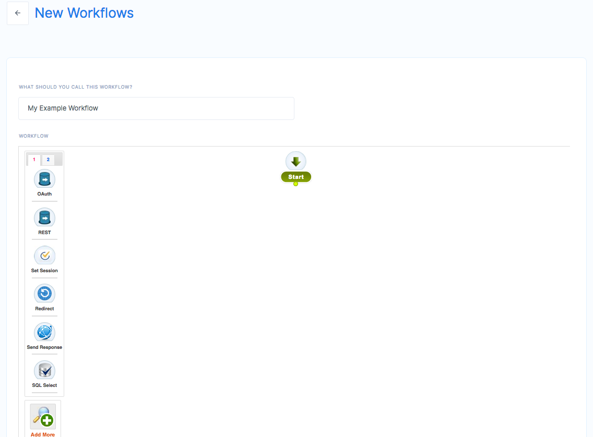
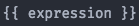
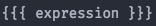
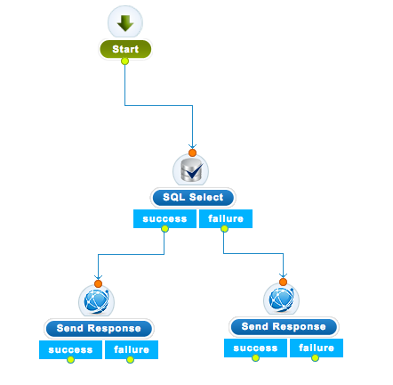

# Workflows

Appup gives you workflows to define business logic for generic business flows independent of the end to end use case. This not only gives you the flexibility to quickly adapt a existing workflow to a new business requirement, it also allows you to manage your IT needs effectively.
Using workflows you can define your business logic with nodes called **Steps** dragged and dropped with your mouse on an empty canvas. It is a visual tool and allows you to sketch a pipeline of various operations without writing a single line of code.
This helps breaks down an application functionality intuitively into several logical steps.  You can map this against the triggering event or action and in minutes take care of the complete end-to-end use case. It is that simple.

You will be creating these multiple times, for each feature your app needs. Therefore it is best to categorize your workflows in a logical manner to be able keep track of what belongs where. Pick and select items from a category to create several different use cases. Stack the steps together like lego blocks to create more robust & comprehensive functionalities. Creating a category is as simple as giving a name.

Click Backend dropdown at the top right of your screen and choose **Category**.

---

The presented screen allows you to manage all your categories. Simply click on **Add Category** button to create your first category. You may create as many categories as you need in the future.

---

Now you are ready to create your first workflow. Get back to *Home/Developer* screen and click **Workflows** to start creating your first workflow. You choose REST, CRON and EVENT workflows. These define how your workflow will be triggered. For now, click REST. You can find more info about these under [Triggers](../triggers/) section.

---

You will be presented with an empty canvas, ready to fill with **Steps** of your needings.

On the left, you can find many steps to choose, sorted by common usage. You can also search for steps if you can't find the one you like on the left by simply clicking on the hourglass button. We are going to start drag and dropping these.

## FTL and Handlebars

Appup currently supports two templating languages to use data inside workflows.

1. [Free Marker Templates (FTL)](https://freemarker.apache.org/)
2. [Handlebars](https://handlebarsjs.com/)

Handlebars can be invoked as follows
* 
* 

The expression inside your templating choice can be any variable you set with a *SetVar* step.

We suggest you to use Handlebars for simple request/response logic. For complex database operations such as SQL queries, FTLs become handy.

## Steps

Steps are, lego like, small, reusable and independent blocks of functionality that can be stitched with each other to give a complete end-to-end application behavior.

For each step you drop in your canvas, you have slots to connect previous and next steps to each other. Orange slots represents incoming flow. Green slots represents outgoing success or failure slots. By connecting these slots with your mouse, you can define any kind of complex logic in your workflows.

---

There are many options for you to utilize as steps.

#### Database 
These are steps which execute SQL commands. You can use any templating option to form your query string.

* [SQL Select](./#sql-select)
* [SQL Select One](./#sql-select-one)
* [SQL Insert](./#sql-insert)
* [SQL Update](./#sql-update)
* [SQL Delete](./#sql-delete)
* [SQL Import](./#sql-import)
* [SQL Export](./#sql-export)
* [Invoke Stored Procedure](./#invoke-stored-procedure)
* [Template](./#template)

#### Auth
These steps handle authentication with JWTs, OAuth, cookies and sessons.

* [FB Refresh Token](./#fb-refresh-token)
* [JWT Step](./#jwt-step)
* [JWT Validation](./#jwt-validation)
* [OAuthNewToken](./#oauthnewtoken)
* [OAuth](./#oauth)
* [OAuthToken](./#oauthtoken)

#### Developers
These steps allow you to run custom code during the flow. Currently Java and Javascript is supported.

* [Java Code Executor](./#java-code-executor)
* [Redirect](./#redirect)
* [Session Step](./#session-step)
* [Set Cookie](./#set-cookie)
* [JS Plugin Code](./#js-plugin-code)
* [JS Code](./#js-code)
* [JS Uploaded Code](./#js-uploaded-code)
* [jedis delete](./#jedis-delete)
* [jedis get](./#jedis-get)
* [jedis put](./#jedis-put)
* [Logs](./#logs)

#### Amazon
These steps allow you to utilize many functionality provided by AWS including S3, SES and many other.

* [S3 File Upload](./#s3-file-upload)
* [S3 File Download](./#s3-file-download)
* [Send Email](./#send-email)
* [Send Email with Attachment](./#send-email-with-attachment)
* [SNS Request Answer](./#sns-request-answer)

#### Google
These steps allow you to utilize many functionality provided by GCP including GAE and PubSub.

* [GAE Select](./#gae-select)
* [GAE Delete](./#gae-delete)
* [Google PubSup](./#google-pubsup)

#### Utility Steps
These steps are a bunch of utilities you may use to implement your business logic. You can set variables, check conditionals and branch according to specific cases.

* [Condition](./#condition)
* [Convert Data](./#convert-data)
* [Emit Event](./#emit-event)
* [Workflow Execute](./#workflow-execute)
* [If Condition](./#if-condition)
* [REST OAuth](./#basic-oauth)
* [REST OAuth Basic](./#basic-oauth-1.0)
* [REST](./#rest)
* [S3 PreSign URL](./#s3-presign-url)
* [Send Step](./#send-response)
* [Set Header](./#set-header)
* [Set Var Multi](./#set-var-multi)
* [Set Var](./#set-var)
* [Switch Case](./#switch-case)

### SQL Select
An SQL Select step allows you to retrieve rows from a database table with a given SQL query. You can access your local variables with FTL or handlerbars.

#### General
| Step Configuration | Purpose                                               |
| ------------------ | ----------------------------------------------------- |
| Database           | Choose one of the databases you installed as a plugin |
| Query              | Specify your SQL query written in FTL or handlebars   |
| Template           | Handlerbars or FTL, your query syntax                 |
| Set Result         | Variable to store the retrieved rows                  |

### SQL Select One
An SQL Select One step allows you to retrieve the first row from a database table with a given SQL query. You can access your local variables with FTL or handlerbars.

#### General
| Step Configuration | Purpose                                               |
| ------------------ | ----------------------------------------------------- |
| Database           | Choose one of the databases you installed as a plugin |
| Query              | Specify your SQL query written in FTL or handlebars   |
| Template           | Handlerbars or FTL, your query syntax                 |
| Set Result         | Variable to store the retrieved rows                  |

### SQL Insert
An SQL Insert step allows you to insert into a database table a given row. You can access your local variables with FTL or handlerbars.

#### General
| Step Configuration | Purpose                                               |
| ------------------ | ----------------------------------------------------- |
| Database           | Choose one of the databases you installed as a plugin |
| Query              | Specify your SQL query written in FTL or handlebars   |
| Template           | Handlerbars or FTL, your query syntax                 |
| Set Result         | Variable to store the retrieved rows                  |

### SQL Insert
An SQL Insert step allows you to insert into a database table a given row. You can access your local variables with FTL or handlerbars.

#### General
| Step Configuration | Purpose                                               |
| ------------------ | ----------------------------------------------------- |
| Database           | Choose one of the databases you installed as a plugin |
| Query              | Specify your SQL query written in FTL or handlebars   |
| Template           | Handlerbars or FTL, your query syntax                 |
| Set Result         | Variable to store the retrieved rows                  |

### SQL Update
An SQL Update step allows you to update existing rows in a database table. You can access your local variables with FTL or handlerbars.

#### General
| Step Configuration | Purpose                                               |
| ------------------ | ----------------------------------------------------- |
| Database           | Choose one of the databases you installed as a plugin |
| Query              | Specify your SQL query written in FTL or handlebars   |
| Template           | Handlerbars or FTL, your query syntax                 |
| Set Result         | Variable to store the retrieved rows                  |

### SQL Delete
An SQL Delete step allows you to delete rows from a database table. You can access your local variables with FTL or handlerbars.

#### General
| Step Configuration | Purpose                                               |
| ------------------ | ----------------------------------------------------- |
| Database           | Choose one of the databases you installed as a plugin |
| Query              | Specify your SQL query written in FTL or handlebars   |
| Template           | Handlerbars or FTL, your query syntax                 |
| Set Result         | Variable to store the retrieved rows                  |

### SQL Import
An SQL Import step allows you import multiple rows into a database table via given file. You can access your local variables with FTL or handlerbars.

#### General
| Step Configuration | Purpose                                                 |
| ------------------ | ------------------------------------------------------- |
| Database           | Choose one of the databases you installed as a plugin   |
| File URL           | Source file to import from                              |
| Header Mappings    | The mapping rules to specify which columns are affected |
| Table              | Table to import into                                    |
| Count              | Number of rows to import                                |
| Output Variable    | A variable name to store the result                     |

### SQL Export
An SQL Export step allows you export multiple rows from a database table into a file. You can access your local variables with FTL or handlerbars.

#### General
| Step Configuration | Purpose                                               |
| ------------------ | ----------------------------------------------------- |
| Database           | Choose one of the databases you installed as a plugin |
| Value              | Value                                                 |
| Type               | Type                                                  |

### Invoke Stored Procedure
This step allows you to execute a stored procedure in your database schema.

#### General
| Step Configuration          | Purpose                                               |
| --------------------------- | ----------------------------------------------------- |
| Database                    | Choose one of the databases you installed as a plugin |
| Call stored procedure query | SQL Query to execute the stored procedure             |

### Template
Set a template SQL query to reuse in other steps multiple times via a name.

#### General
| Step Configuration | Purpose                                    |
| ------------------ | ------------------------------------------ |
| Value              | Template string to store                   |
| Template           | Template format, either handlerbars or FTL |
| Set Result         | Variable name to store the template        |

### FB Refresh Token
This step refresh your Facebook OAuth token.

#### General
| Step Configuration | Purpose                                      |
| ------------------ | -------------------------------------------- |
| Select type        | Template format, either handlerbars or FTL   |
| Plugin             | Choose one of the installed Facebook plugins |
| Output Variable    | Variable name to store the result            |
| Access token       | Access token                                 |

### JWT Step
This step creates a JWT for latter use.

#### General
| Step Configuration | Purpose                                                                                       |
| ------------------ | --------------------------------------------------------------------------------------------- |
| Output Variable    | Variable name to store the token                                                              |
| Select Type        | Template format to use in claims                                                              |
| Claims             | Claims to add as key value pairs, click + to add new claims, use templates to store variables |
| Subject            | Subject the token is relevant to                                                              |
| JWT plugin         | Key to encrypt your JWT                                                                       |

### JWT Validation
This step validates a previously created JWT.

#### Settings
| Step Configuration | Purpose                                              |
| ------------------ | ---------------------------------------------------- |
| Source             | Expression to add to validation, click + to add more |
| Name               | Name of your validation                              |
| Output Variable    | A variabe name to store the result                   |
| Select Type        | Template format to use in expressions                |
| JWT plugin         | Key to decrypt your JWT                              |

### OAuthNewToken
This step requests a new token from your 3rd party service.

#### Info
| Step Configuration | Purpose                                   |
| ------------------ | ----------------------------------------- |
| Select Type        | Template format to use, handlebars or FTL |
| Plugin             | Your 3rd party OAuth plugin               |
| Output Variable    | A variabe name to store the result        |
| Refresh Token      | Refresh Token                             |

### OAuth
This step starts an OAuth flow with one of your 3rd party services.

#### Info
| Step Configuration | Purpose                                                              |
| ------------------ | -------------------------------------------------------------------- |
| Select Type        | Template format to use, handlebars or FTL                            |
| Plugin             | Your 3rd party OAuth plugin                                          |
| Redirect URL       | URL to redirect after OAuth setup                                    |
| Parameters         | Key/value pair to include in your OAuth request, click + to add more |

### OAuthToken
This step concludes an OAuth flow with one of your 3rd party services.

#### Info
| Step Configuration | Purpose                                                              |
| ------------------ | -------------------------------------------------------------------- |
| Select Type        | Template format to use, handlebars or FTL                            |
| Plugin             | Your 3rd party OAuth plugin                                          |
| Output Variable    | Variable nme to store the token                                      |
| Parameters         | Key/value pair to include in your OAuth request, click + to add more |

### Redirect
This step redirects a client to a given URL.

#### Settings
| Step Configuration | Purpose                       |
| ------------------ | ----------------------------- |
| URL                | Choose a URL to redirect to   |
| Status Code        | Status Code to send to client |

### Session Step
This step stores variables in a session.

#### Settings
| Step Configuration | Purpose                                      |
| ------------------ | -------------------------------------------- |
| Name               | Name of the session                          |
| Value              | Value to store in session as template string |
| Select Template    | Template to use in value, handlebars or FTL  |

### Set Cookie
This step sets a cookie to be stored in the client.

#### Settings
| Step Configuration                      | Purpose                                         |
| --------------------------------------- | ----------------------------------------------- |
| Enter the name of the cookie            | Can be any name                                 |
| Enter the value to be set in the cookie | A templte string                                |
| Template type                           | Handlebars or FTL                               |
| Cookie Path                             | Path to apply to cookie relative to host domain |
| Cookie Domain                           | Host domain                                     |
| Cookie Max Age                          | in miliseconds                                  |
| Cookie Version                          | Optional version string                         |
#### More Options
| Step Configuration    | Purpose                                        |
| --------------------- | ---------------------------------------------- |
| Cookie Expiry minutes | Expiration time                                |
| Discard Cookie        | Choose whether you want to discard it          |
| Secured Cookie        | Choose whether you want to encrypt your cookie |
| Is it a HTTP cookie   | Choose whether the cookie is availabl in HTTP  |
| Cookie Comment        | A helper text to recognize the cookie          |
#### Help
Here are help instruction about cookies.

### Java Code Executor
This step executes a custom Java code.

#### Settings
| Step Configuration | Purpose                        |
| ------------------ | ------------------------------ |
| Class Name         | Class to execute               |
| Package Name       | The package class is stored in |

### JS Plugin Code
This steps executes a custom Javascript code stored in plugin.

#### General
| Step Configuration | Purpose                    |
| ------------------ | -------------------------- |
| code               | Stored js code plugin name |

### JS Code
This steps executes a hardcoded Javascript code.

#### Settings
| Step Configuration | Purpose                                      |
| ------------------ | -------------------------------------------- |
| Source             | Source code for executed javascript function |

### JS Uploaded Code
This steps executes a stored Javascript file contents.

#### Settings
| Step Configuration     | Purpose                                |
| ---------------------- | -------------------------------------- |
| File Path              | The place where your js file is stored |
| Function               | Function to execute in your file       |
| Return Output Variable | Variable name to store output result   |

### jedis delete
This step deletes a value from a Redis database via jedis.

#### General
| Step Configuration  | Purpose                        |
| ------------------- | ------------------------------ |
| Template            | Handlebars or FTL              |
| Select Data Type    | Data type to delete            |
| Enter the key value | Key to delete                  |
| jedis Plugins       | The Redis plugin you installed |

### jedis get
This step gets a value from a Redis database via jedis.

#### General
| Step Configuration  | Purpose                        |
| ------------------- | ------------------------------ |
| Template            | Handlebars or FTL              |
| Select Data Type    | Data type to get               |
| Enter the key value | Key to get                     |
| jedis Plugins       | The Redis plugin you installed |

### jedis put
This step puts a value into a Redis database via jedis.

#### General
| Step Configuration  | Purpose                        |
| ------------------- | ------------------------------ |
| Template            | Handlebars or FTL              |
| Select Data Type    | Data type to put               |
| Enter the key value | Key to put                     |
| Value to save       | Value to save inside db        |
| jedis Plugins       | The Redis plugin you installed |

### Logs
This step logs developer messages to the console.

#### Settings
| Step Configuration | Purpose                          |
| ------------------ | -------------------------------- |
| Log Levels         | Choose the level you want to use |
| Message            | Message to log                   |

### S3 File Upload
This steps allows you to upload file to an S3 bucket.

#### General
| Step Configuration | Purpose                                  |
| ------------------ | ---------------------------------------- |
| File Name          | Name of the file                         |
| File Data          | File contents as template string         |
| Output Variable    | Output variable name to store the result |
| Bucket Name        | S3 Bucket name                           |
| Content Type       | Content type of the uploaded file        |
| Type               | Data type, either handlebars or FTL      |
| File Access        | Access permissions                       |
| S3 Plugin          | One of the installed S3 plugins to use   |

### S3 File Download
This steps downloads a file from an S3 bucket.

#### General
| Step Configuration | Purpose                                  |
| ------------------ | ---------------------------------------- |
| File Name          | Name of the file                         |
| Output Variable    | Output variable name to store the result |
| Type               | Data type, either handlebars or FTL      |
| Bucket Path        | Path of the downloaded file              |
| S3 Plugin          | One of the installed S3 plugins to use   |

### Send Email
This steps sends an emal via SES.

#### General
| Step Configuration | Purpose                                 |
| ------------------ | --------------------------------------- |
| Character Encoding | Encoding to use in body                 |
| Select Type        | Template type for body text             |
| Email Plugin       | One of the installed SES plugins to use |
#### Info
| Step Configuration | Purpose                               |
| ------------------ | ------------------------------------- |
| From (name)        | Sender's Name                         |
| From (email)       | Sender's Email Address                |
| To                 | Recipients Email Address              |
| CC                 | Comma separated CC email adress list  |
| BCC                | Comma separated BCC email adress list |
| Subject            | Email subject                         |
#### Body
| Step Configuration | Purpose      |
| ------------------ | ------------ |
| Body Type          | Text or HTML |
| Body               | Body to send |

### Send Email with Attachment
This steps sends an emal via SES with added attachment.

#### General
| Step Configuration | Purpose                                 |
| ------------------ | --------------------------------------- |
| Character Encoding | Encoding to use in body                 |
| Select Type        | Template type for body text             |
| Config Set         | Configuration                           |
| File Key           | File to send as attachment              |
| Email Plugin       | One of the installed SES plugins to use |
#### Info
| Step Configuration | Purpose                               |
| ------------------ | ------------------------------------- |
| From (name)        | Sender's Name                         |
| From (email)       | Sender's Email Address                |
| To                 | Recipients Email Address              |
| CC                 | Comma separated CC email adress list  |
| BCC                | Comma separated BCC email adress list |
| Subject            | Email subject                         |
#### HTML
HTML body of sent email, can be empty.
#### Text
Text body of sent email, can be empty.

### SNS Request Answer
TODO

### GAE Select
This steps retrieves data from a GAE db.

#### General
| Step Configuration | Purpose                          |
| ------------------ | -------------------------------- |
| GAE Database       | One of the installed GAE plugins |
| Type               | Database type                    |
#### Settings
| Step Configuration | Purpose                            |
| ------------------ | ---------------------------------- |
| Output Variable    | Variable name to store the results |

### GAE Delete
This steps deletes data from a GAE db.

#### General
| Step Configuration | Purpose                          |
| ------------------ | -------------------------------- |
| GAE Database       | One of the installed GAE plugins |
| Type               | Database type                    |
#### Settings
| Step Configuration | Purpose                            |
| ------------------ | ---------------------------------- |
| Output Variable    | Variable name to store the results |

### Google PubSup
This step publishes data to a Pubsub topic.

#### Publish
| Step Configuration | Purpose                     |
| ------------------ | --------------------------- |
| Topic Name         | Topic to publish into       |
| JSON File Location | Pubsub config file location |
| Payload to publish | Data to send to the topic   |

### Condition
This step checks for a composite condition formed by logical "and"/"or" statements. The configured check will be evaluated in the form `(x1 and x2 and x3...) or (y1 and y2 and y3...)`.

Available options are `less than`, `less than or equals`, `equal to`, `greater than`, `greater than or equals`, `not equals`, `in`, `contains`.

#### Settings
| Step Configuration | Purpose                              |
| ------------------ | ------------------------------------ |
| And                | Press + to add a check               |
| Or                 | Press + to add a check               |
| Output Variable    | Variable name to store the output in |
#### General
| Step Configuration | Purpose                          |
| ------------------ | -------------------------------- |
| Select Type        | Used template, handlebars or FTL |

### Convert Data
This step converts `json`, `xml` or `yaml` to each other.

#### General
| Step Configuration | Purpose                           |
| ------------------ | --------------------------------- |
| Convert From       | Source file type                  |
| Convert To         | Destination file type             |
| Output Variable    | Variable name to store the result |
| Value Type         | Source expression template format |
| Data               | Data to convert                   |

### Emit Event
This step emits an event to be captured by an Appup trigger.

#### Settings
| Step Configuration | Purpose                    |
| ------------------ | -------------------------- |
| Topic              | Topic to send the event    |
| Value              | Sent event value           |
| Output Variable    | Output to store the result |
#### General
| Step Configuration | Purpose                                     |
| ------------------ | ------------------------------------------- |
| Plugin             | Choose on of the relevant installed plugins |
#### Help
| Step Configuration           | Purpose |
| ---------------------------- | ------- |
| Write your own function here | TODO    |

### Workflow Execute
This step executes another Appup Workflow.

#### Settings
| Step Configuration | Purpose                                         |
| ------------------ | ----------------------------------------------- |
| Exception Handle   | What to do in case the executed workflows fails |
| Workflow ID        | Choose a workflow to execute                    |

### If Condition
This steps checks for a single condition.

Available options are `less than`, `less than or equals`, `equal to`, `greater than`, `greater than or equals`, `not equals`, `in`, `contains`.

#### Settings
| Step Configuration | Purpose                              |
| ------------------ | ------------------------------------ |
| Output Variable    | Variable name to store the result in |
| if                 | Type of checked values               |
| variable 1         | First variable to compare            |
| Compare this       | Compare type                         |
| variable 2         | Second variable to compare           |
| Select type        | Template type to use in comparison   |

### REST OAuth
This step executes a REST request with one of your configured OAuth tokens.

#### Settings
| Step Configuration | Purpose                                      |
| ------------------ | -------------------------------------------- |
| URL                | URL to send the request                      |
| Method Type        | HTTP method type                             |
| Query Parameters   | Query parameters to send, click + to add one |
#### Auth Info
| Step Configuration | Purpose               |
| ------------------ | --------------------- |
| Consumer key       | OAuth Consumer key    |
| Consumer Secret    | OAuth Consumer secret |
| Token              | Access token          |
| Secret             | Access secret         |
#### Headers
| Step Configuration | Purpose                             |
| ------------------ | ----------------------------------- |
| Headers            | Click + to add HTTP request headers |
#### Body
| Step Configuration | Purpose                             |
| ------------------ | ----------------------------------- |
| Body               | Click + to add HTTP body parameters |
#### More Settings
| Step Configuration | Purpose                             |
| ------------------ | ----------------------------------- |
| Result             | Variable name to save the result in |
| Select Type        | Template type to                    |

### REST OAuth Basic
This step is used to make REST call with basic authentication.

#### Settings
| Step Configuration | Purpose                                      |
| ------------------ | -------------------------------------------- |
| URL                | URL to send the request                      |
| Method Type        | HTTP method type                             |
| Query Parameters   | Query parameters to send, click + to add one |
#### Auth Info
| Step Configuration | Purpose             |
| ------------------ | ------------------- |
| Username           | Basic auth username |
| Password           | Basic auth password |
#### Headers
| Step Configuration | Purpose                             |
| ------------------ | ----------------------------------- |
| Headers            | Click + to add HTTP request headers |
#### Body
| Step Configuration | Purpose                             |
| ------------------ | ----------------------------------- |
| Body               | Click + to add HTTP body parameters |
#### More Settings
| Step Configuration | Purpose                             |
| ------------------ | ----------------------------------- |
| Result             | Variable name to save the result in |
| Select Type        | Template type to                    |

### REST
This step is used for calling third party API endpoints inside of your workflow. In order to configure a REST step, you have these tabs where each of them exposes a bunch configurations to tailor the request according to your preferences.

#### Settings
| Step Configuration | Purpose                                      |
| ------------------ | -------------------------------------------- |
| URL                | URL to send the request                      |
| Method Type        | HTTP method type                             |
| Query Parameters   | Query parameters to send, click + to add one |
#### Headers
| Step Configuration | Purpose                             |
| ------------------ | ----------------------------------- |
| Headers            | Click + to add HTTP request headers |
#### Body
| Step Configuration | Purpose                             |
| ------------------ | ----------------------------------- |
| Body               | Click + to add HTTP body parameters |
#### More Settings
| Step Configuration | Purpose                             |
| ------------------ | ----------------------------------- |
| Result             | Variable name to save the result in |
| Select Type        | Template type to                    |

### Send Step
This step is used to send respones to the connecting HTTP clients.

### Settings
| Step Configuration    | Purpose                        |
| --------------------- | ------------------------------ |
| Variable Name         | Variable to send               |
| Response Code         | HTTP status code to send       |
| Response Content Type | HTTP content type header value |
| Template              | Variable template type         |

### S3 PreSign URL
This step is used to presign an S3 request for clients.

#### Settings
| Step Configuration | Purpose                                    |
| ------------------ | ------------------------------------------ |
| Name               | Name of the signed file                    |
| Output Variable    | Variable name to store the result in       |
| S3 File Expiration | Expiration time in seconds                 |
| S3 Bucket Name     | S3 bucket name                             |
| Select Template    | Template to use in data, handlebars or FTL |
| Method Type        | S3 request method type                     |
| Plugin             | S3 plugin to use                           |

### Set Header
This step is used to set response header parameters for connecting HTTP clients.

### More Settings
| Step Configuration | Purpose                          |
| ------------------ | -------------------------------- |
| Template           | Template to use in header values |
### Headers
| Step Configuration | Purpose                             |
| ------------------ | ----------------------------------- |
| Headers            | Click + to add HTTP request headers |

### Set Var Multi
This step is used to set multiple local variables.

#### Settings
| Step Configuration           | Purpose                                   |
| ---------------------------- | ----------------------------------------- |
| Is JSON                      | Tells if the stored data is JSON          |
| Name                         | Name of the stored data                   |
| Variables                    | Variable names to set, click + to add one |
| Select Template              | Template to use in variable expressions   |
| Encode or decode from base64 | Whether the stored data is base64 or not  |
| Charset to use               | Data charset to use in variables          |

### Set Var
This step is used to set a single local variable.

#### Settings
| Step Configuration           | Purpose                                  |
| ---------------------------- | ---------------------------------------- |
| Enter name of the variable   | Name of the variable                     |
| Value                        | Value to store in variable               |
| Select Template              | Template to use in variable expressions  |
| Encode or decode from base64 | Whether the stored data is base64 or not |
| Charset to use               | Data charset to use in variables         |

### Switch Case
This step is used to check for a pattern matching condition.

#### Settings
| Step Configuration         | Purpose                             |
| -------------------------- | ----------------------------------- |
| Template Type              | Template to use in case expressions |
| Switch Case Input Variable | Variable to check for patterns      |
| Cases                      | Click + to add a pattern case       |
