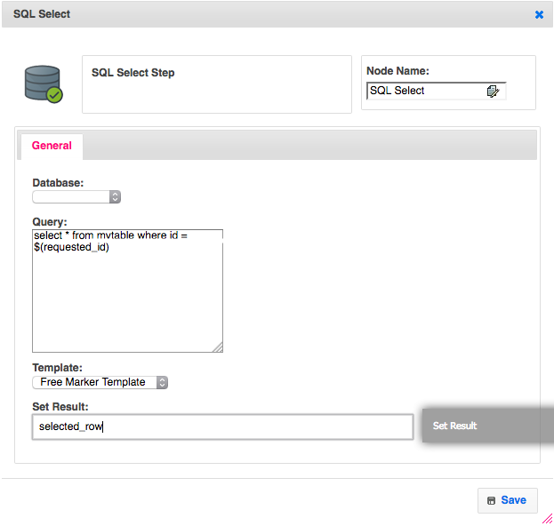
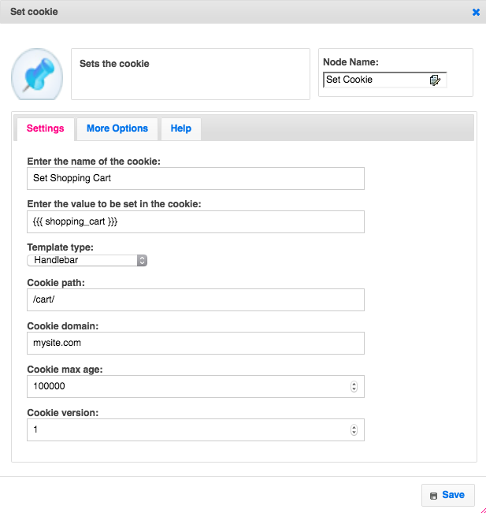
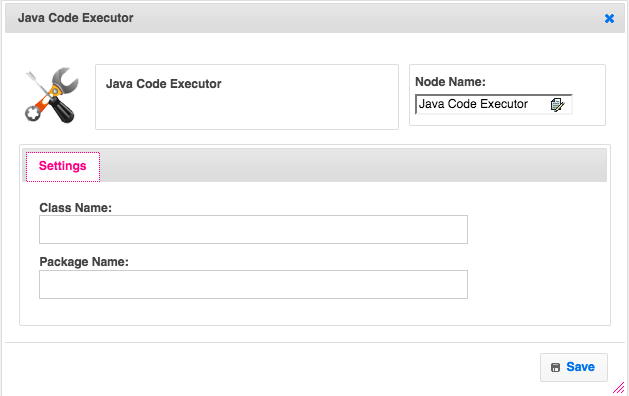
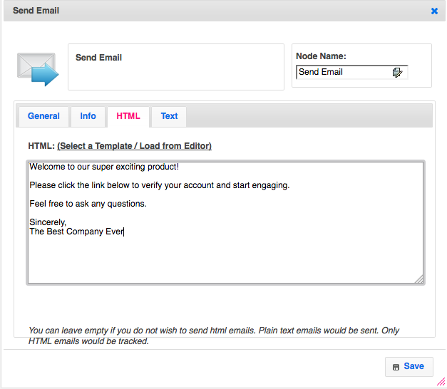
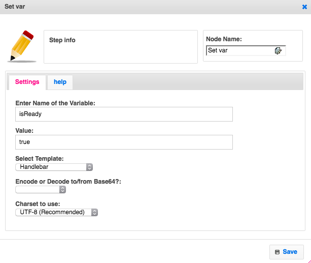
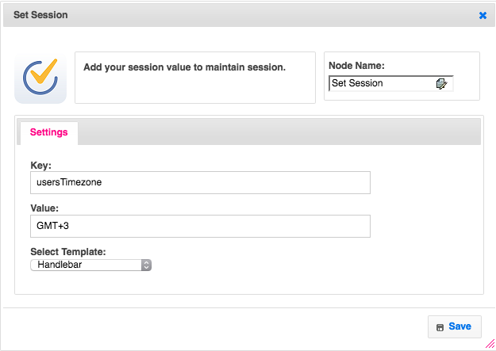

# Workflows

Workflows allow you to define your business logic with nodes called **Steps** dragged and dropped with your mouse on an empty canvas. It is a visual tool and allows you to sketch a pipeline of various operations without writing a single line of code.
This helps breaks down an application functionality intuitively into several logical steps.  You can map this against the triggering event or action and in minutes take care of the complete end-to-end use case. It is that simple.

You will be creating these multiple times, for each feature your app needs. Therefore it is best to categorize your workflows in a logical manner to be able keep track of what belongs where. Pick and select items from a category to create several different use cases. Stack the steps together like lego blocks to create more robust & comprehensive functionalities. Creating a category is as simple as giving a name.

Click Backend dropdown at the top right of your screen and choose **Category**.

---

The presented screen allows you to manage all your categories. Simply click on **Add Category** button to create your first category. You may create as many categories as you need in the future.

---

Now you are ready to create your first workflow. Get back to *Home/Developer* screen and click **Workflows** to start creating your first workflow. You choose REST, CRON and EVENT workflows. These define how your workflow will be triggered. For now, click REST. You can find more info about these under [Triggers](../triggers/) section.

---

You will be presented with an empty canvas, ready to fill with **Steps** of your needings.

On the left, you can find many steps to choose, sorted by common usage. You can also search for steps if you can't find the one you like on the left by simply clicking on the hourglass button. We are going to start drag and dropping these.

## FTL and Handlebars

Appup currently supports two templating languages to use data inside workflows.

1. [Free Marker Templates (FTL)](https://freemarker.apache.org/)
2. [Handlebars](https://handlebarsjs.com/)

::: danger Note
Use  instead of  in order not to accidentally escape your strings in Handlebars.
:::

The expression inside your templating choice can be any variable you set with a *SetVar* step.

We suggest you to use Handlebars for simple request/response logic. For complex database operations such as SQL queries, FTLs become handy.

## Steps

Steps are, lego like, small, reusable and independent blocks of functionality that can be stitched with each other to give a complete end-to-end application behavior.

For each step you drop in your canvas, you have slots to connect previous and next steps to each other. Orange slots represents incoming flow. Green slots represents outgoing success or failure slots. By connecting these slots with your mouse, you can define any kind of complex logic in your workflows.

---

There are many options for you to utilize as steps.

### Database Steps
These are steps which execute SQL commands. You can use any templating option to form your query string.

SQL Select Example:

### Auth Steps
These steps handle authentication with JWTs, OAuth, cookies and sessons.

Set Cookie Example:

### Developer Steps
These steps allow you to run custom code during the flow. Currently Java and Javascript is supported.

#### Java Steps
There are builtin steps which accept Java packages and classes inside the workflow toolset.

Inside your workflow click **Add More** on the left. Select **Developer** tab and find the **Java Code Executor** step.

It expects the class name and package name of your uploaded java class file which contains your plugin executor.

#### Javascript Steps
For Javascript, you have multiple builtin steps to choose from. You can either directly write Javascript code inside of the step or select a file by giving its path. Both methods execute given Javascript logic inside the workflow to determine the result.

### Amazon Steps
These steps allow you to utilize many functionality provided by AWS including S3, SES and many other.

Send Email Example:

### Google Steps
These steps allow you to utilize many functionality provided by GCP including GAE and PubSub.

### Utility Steps
These steps are a bunch of utilities you may use to implement your business logic. You can set variables, check conditionals and branch according to specific cases.

Set Variable Example:

## Sessions
A session is the user's interaction with a website within a given time frame, as measured from the first touchpoint or login with the web application to the logout or exit from the web application.

You can maintain variables during the user's visit inside a storage allocated for the session.

Set Session Example:

