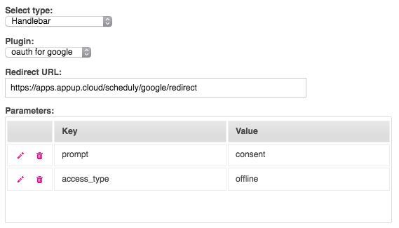

# Google OAuth for Login

## Overview

Many 3rd party services such us Google, Facebook, Linkedin etc provide authentication services that works out of box. By utilising these services, you can implement an authentication scheme in your app without worrying about all the necessary validation questions such as:

* Is the given email during sign up valid?
* Is the user who signs up a real person?
* Is the password secure enough?

By using Appup's OAuth plugins and provided steps in the Workflows, integrating such services becomes really easy. This example will instruct you with necessary steps you should take in order to have a working authentication scheme in you app.

## Choose a Provider

The first thing you should do is to choose one of the [providers](/docs/backend/plugins/#oauth) in the plugins and setup the plugin accordingly. In our example, we are going to use Google but you are free to choose another one as they all work the same.

You need to create your OAuth credentials to setup the plugin. [Login](https://console.developers.google.com) to Google's dashboard with your company email and create the credentials. Take a note of your Key and Secret. You also need to select the scope of your authentication. We are going to use `profile` to simply be able to access the user's email address.

Go to Plugins, click Add Plugins, navigate to OAuth and install a Google OAuth plugin.


Choose an easy to remember name. Paste your Key and Secret which took a note before. Finally type `profile` into the scope field. Click save and you are ready.

## Setup Workflows
You need to setup two workflows for this. One to initiate the authentication, one to retrieve the user's OAuth token.

Create a workflow named `google_oauth` and add an OAuth step into it like below.


You need to choose you previously installed OAuth plugin. You also need to provide a redirect URL to tell Google where to navigate after it does its job. Redirect URL should look like `https://apps.appup.cloud/YOURAPPNAME/google/redirect`.

If you need to provide additional configuration for your OAuth, please refer to [Google's docs](https://developers.google.com/identity/protocols/OAuth2WebServer#creatingclient) to see available parameters.



Save you first handler and close it.

We need one last workflow to retrieve our token from Google servers.

Create a workflow named `google_oauth_token` and add an OAuthToken step into it like below.


You need to choose your plugin and specify a name for the retrieved token. We will use the output variable to update our database with the latest working token.


You can use an SQL Update step to store the token in your database and a Redirect step to navigate to your post auth screen.

## Setup Triggers

We need to create triggers for each of our workflows to be able to call them from our pages. Each trigger will specify a URL that belongs to our workflows.

Navigate to Triggers, click Add Trigger.


You can choose an easy to remember name for each one of your triggers. If you are in doubt, use the tables below as reference.

#### First Trigger
| Field           | Value                |
| --------------- | -------------------- |
| Name            | google_oauth_trigger |
| Category        | your category        |
| Method          | GET                  |
| Expression      | `google/oauth`       |
| What to Execute | google_oauth         |

#### Second Trigger
| Field           | Value                      |
| --------------- | -------------------------- |
| Name            | google_oauth_token_trigger |
| Category        | your category              |
| Method          | GET                        |
| Expression      | `google/redirect`          |
| What to Execute | google_oauth_token         |

## Initiate OAuth from Frontend

Create a page that includes a button which navigates to your first workflow.

```html
<a href="/YOURAPPNAME/google/oauth">Login with Google</a>
```

Create a second page with the same URL you provided in the second workflow's Redirect step to welcome your authenticated users.

```html
<h1>Welcome to YOURAPPNAME</h1>
```

Congratulations! You created a working OAuth process for your app.

**Happy hacking!**
