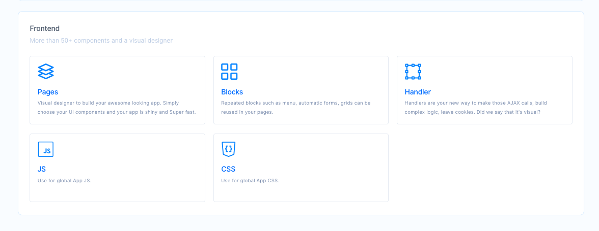

# Frontend

You will learn how to use Frontend features to connect your workflows to your app's UI here. 

The main toolset we are going to use consists of **Pages**, **Blocks** and **Handlers**.

Creating a frontend is as simple as selecting a template for the page, adding the required predefined blocks in the page and make handlers to map the business logic to specific elements of the page. Incorporating reusable components in your frontend reduces your development time and enhances the quality of all your deliverables. Just like backend tools, all frontend tools also support categorization. 
