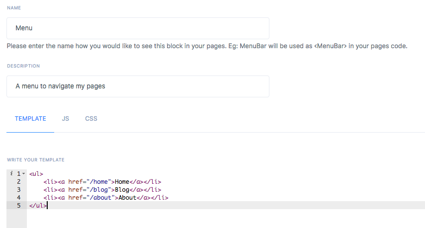

# Blocks
Blocks are reusable components you create in Appup. They can be simple widgets, action bars or menus. You create blocks just like you create pages.


Blocks have names, descriptions and sections the same as pages except JSON.



Once you create a block, you can use it inside any page you want via its name.

```html
<div id="mypage">
  <Menu />
</div>
```
## Events
**TODO : What is events in blocks?**
