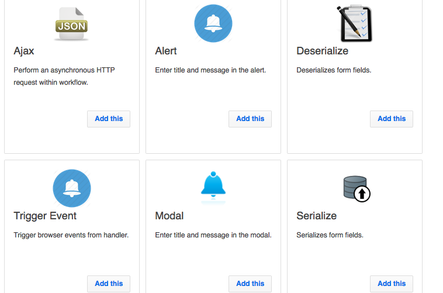

# Handlers
Handlers are workflows for frontend. You use the same node based canvas to create frontend logic. The steps here are now behaviors working in your users' browser instead of your server. Handlers are used to run business logic, make AJAX calls and preload forms or custom components.

## Preloading
Preloading means running a handler before a component is shown to the user. With preloading, you apply configuration you defined in your global JSON section into your components. Forms use preloading to configure what kind of inputs to show, what to do on submit and how to validate. Blocks use preloading to setup the behavior of their corresponding UI widget.

In order to preload a component, set it template as `<component preload="handlername" />`. Then create a handler with the same name and use a Javascript step filled like below.

### Forms
```javascript
function(data, ui){
	if(window.UIJSON[ui.workflow_params.entity].submit) {
		ui.submit=window.UIJSON[ui.workflow_params.entity].submit;
 	}

	ui.formFields = window.UIJSON[ui.workflow_params.entity].fields;
	ui.buttons = window.UIJSON[ui.workflow_params.entity].buttons;
}
```
## Steps
Handler steps come with a wide range of selections.

### Database
You can use database steps to manipulate browser cookies or manage localstorage.


### Developers
In a handler, you can inject javascript code the same way you do in workflows. It is also possible to validate forms or redirect to URLs via steps inside **Developers** section


### Utilities
It is possible to send an AJAX request, serialize/deserialize form fields, show modal or alerts and trigger backend [Events](/docs/backend/triggers/#event) via steps in Utilities tab.


