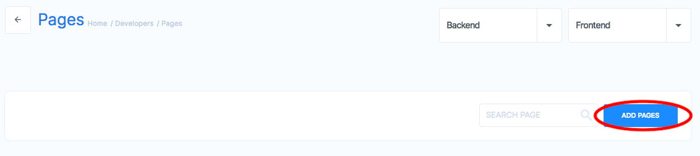
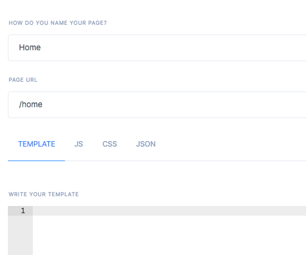
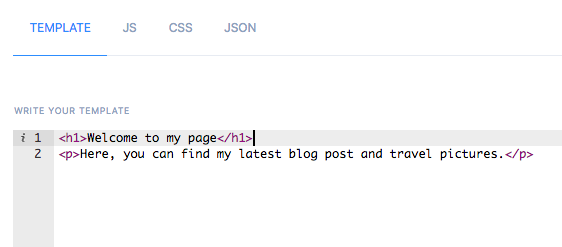
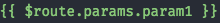
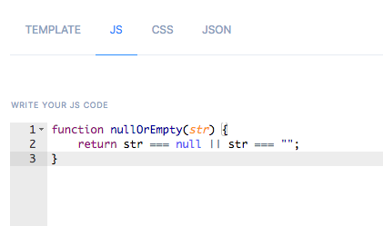
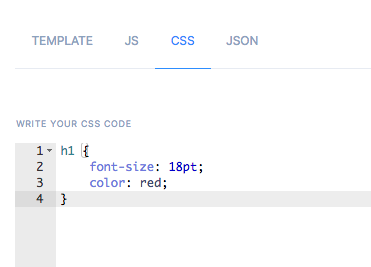
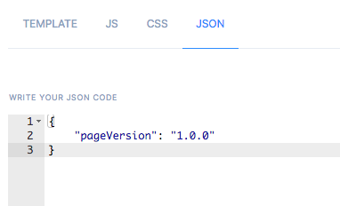
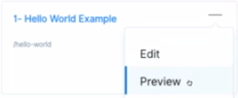

# Pages
Appup pages can go live in as early as ten minutes if you know your requirement and our platform well.  It gives you a variety of "ready-to-deploy" templates and several different components & readymade blocks that you can quickly add to the template selected to suit your page requirements. And above all, these are all available without any compromise on quality or performance. Try it now ! 

A page in appup is a collection of blocks and handlers. They are the top level scope holders. 
There are four different code sections you can include in your pages. 
* A template
* Javascript code
* CSS rules  
* global JSON objects.

We will talk about them in detail later. Let us look at how to define a page in appup:

A page has a name, a URL and a template describing what to show. When you create a page, you use regular HTML as well as custom defined **Blocks** to populate it according to your needs.

In order to create a page, select **Pages** from your dashboard and click Add Pages button.


---

You will be asked for a name, a URL and page contents.


## Page Sections
### Template
Templates are the main HTML that represents your pages. It supports all the vanilla HTML elements in your disposal. Moreover, it has the capability to inject [Blocks](/docs/frontend/blocks) which allows you to reuse existing components multiple times with only copying a single line of code.



#### Routing
By customizing the page URL, you configure dynamic routing as well as use the route parameters right inside your page.

Form your URL like `/path/to/page/:param1/:param2` to be able to access `param1` or `param2` inside your template. Once you configure the URL, your custom parameters will be available to be used in your template with  syntax. You will be able to run custom logic with [Handlers](/docs/frontend/handlers) using these route parameters.

```html
<h1 class="entity_params">param1 is {{$route.params.param1}}</h1>
<h1 class="entity_params">param2 is {{$route.params.param2}}</h1>
```

All your parameters are accessible under `$route.params`.

### Javascript
You can include custom Javascript code, scoped at the page level to incorporate any Javascript tooling of your preference. The functions included in this section will be globally available for all components throughout your page.



### CSS
Custom CSS or frontend frameworks can also be loaded in your page by including the rules inside CSS section. The rules written here is available to all HTML elements as well as the custom javascript you include. This is the perfect place for creating generic themes in your page.



### JSON
Chances are you are going to need global customization parameters which will effect your Javascript logic and custom components. In this case, JSON section is the tool for you. Whatever written in this section will be available in Javascript via `window.UIJSON`.



---

You will also be able to use these JSON values to automatically populate smart [Form](./#form) elements.

## Components
Appup provides many ready to use components for handling complex but very common tasks such as creating and validating forms. You can utilize these components in your pages to create sophisticated controls in your UI.

### Form
Appup forms a unique and easy to use way to quickly create dynamic, self validating forms. They configured via global JSON and allows you to include many smart input elements such as text, number, dropdowns and buttons.

You use an Appup form by including the following code in your template. Replace `<Your Handler Name>` with a custom handler you create to specify the form behavior.

```html
<!-- Appup form component start -->
<appup-form  preload="<Your Handler Name>"
   :workflow_params='{entity:"<Global JSON Key>"}'
/>
<!-- Appup form component end -->
```

---

Then you configure what kind of inputs you want to show via global JSON by specifying a `<Global JSON Key>`.

```json
{
	"<Global JSON Key>": {
		"fields": [
			fields...
		],
		"buttons": [
			buttons...
		],
		"post": "login"
	}
}
```

---

The name you provide to `:workflow-params` should match the JSON key of your form configuration. Once your configuration is complete, you will use `preload` to set a [Handler](/docs/frontend/handlers) to finalize your form logic. Use a Javascript step inside your handler, set up like below.

```javascript
function(data, ui){
	if(window.UIJSON[ui.workflow_params.entity].submit) {
		ui.submit=window.UIJSON[ui.workflow_params.entity].submit;
 	}

	ui.formFields = window.UIJSON[ui.workflow_params.entity].fields;
	ui.buttons = window.UIJSON[ui.workflow_params.entity].buttons;

	// use ui object to decide what to do
}
```

---

#### Fields

Below are instructions to how to define a field by field type.

##### Email Field
This is a field that automatically checks if the given text is a legitimate email address.

| Field Config | Description                                    |
| ------------ | ---------------------------------------------- |
| id           | A unique id number                             |
| type         | Must be `email`                                |
| name         | Field name                                     |
| placeholder  | Placeholder text to show if the input is empty |
| label        | HTML label for the component                   |
| required     | Whether the component is required or not       |

```json
{
	"<Global JSON Key>": {
		"fields": [
			{
				"id": 1000,
				"type": "email",
				"name": "email",
				"placeholder": "Login",
				"label": "",
				"required": true
			}
		],
		...
	}
}
```

##### Password Field
This is a password field with configurable length checks.

| Field Config | Description                                    |
| ------------ | ---------------------------------------------- |
| id           | A unique id Number                             |
| type         | Must be `password`                             |
| name         | Field name                                     |
| placeholder  | Placeholder text to show if the input is empty |
| label        | HTML label for the component                   |
| required     | Whether the component is required or not       |
| minLength    | Minimum allowed length for the password         |
| maxLength    | Maximum allowed length for the password         |

```json
{
	"<Global JSON Key>": {
		"fields": [
			{
				"id": 1045,
				"type": "password",
				"name": "password",
				"hints": "insert hints here",
				"placeholder": "Password",
				"label": "",
				"required": true,
				"minLength": 4,
				"maxLength": 10
			}
		],
		...
	}
}
```

##### Static Dropdown
Adding a dropdown filled with static data is only a matter of configuration in your global JSON.

| Field Config | Description                                                 |
| ------------ | ----------------------------------------------------------- |
| id           | A unique id Number                                          |
| type         | Must be `password`                                          |
| name         | Field name                                                  |
| placeholder  | Placeholder text to show if the input is empty              |
| label        | HTML label for the component                                |
| required     | Whether the component is required or not                    |
| class        | CSS class value                                             |
| option       | An object with the keys `value` and `label`  set like below |

```json
{
	"myform": {
		"fields": [
			{
				"id": 10,
				"type": "dropdown",
				"name": "cloud_type",
				"label": "Cloud Type",
				"option": [
					{
						"value": null,
						"label": "Please select an option"
					},
					{
						"value": "Appup",
						"label": "Appup"
					},
					{
						"value": "Amazon",
						"label": "Amazon"
					},
					{
						"value": "Google",
						"label": "Google"
					}
				],
				"required": true,
				"class": "col-sm-12 col-md-6 select"
			}
		]
	}
}
```
##### Dynamic Dropdown
However if the dropdown needed to be populated by dynamically queried data, you can provide a url such that when called with GET, return a JSON array of key-value pairs. You can choose which fields to consider as keys and values by setting their names in the configuration like below.

| Field Config | Description                                    |
| ------------ | ---------------------------------------------- |
| id           | A unique id Number                             |
| type         | Must be `password`                             |
| name         | Field name                                     |
| label        | HTML label for the component                   |
| required     | Whether the component is required or not       |
| key_value    | JSON key to check for retrieved dynamic values |
| key_label    | HTML label to fill with the values             |
| class        | CSS class value                                |

```json
{
	"myform": {
		"fields": [
			{
					"id": 10,
					"type": "dropdown",
					"name": "name",
					"label": "Select Name",
					"key_value": "id",
					"key_label": "name",
					"url": "https://jsonplaceholder.typicode.com/users/",
					"required": true,
					"class": "col-sm-12 col-md-6 select"
			}
		]
	}
}
```

##### Code Editor
If you want to include a source code editor in your form, add the following lines to your global json.

| Field    | Description                                                    |
| -------- | -------------------------------------------------------------- |
| id       | A unique id Number                                             |
| type     | This should be `code-editor`                                   |
| lang     | Editor language of the text area, used for syntax highlighting |
| name     | Name of the field                                              |
| height   | Frame height                                                   |
| width    | Frame width                                                    |
| rows     | Number of rows in the editor                                   |
| max-row  | Max number of rows                                             |
| label    | HTML label for the component                                   |
| required | Whether the component is required or not                       |
| class    | CSS class value                                                |

```json
{
	"myform": {
		"fields": [
			{
			  "id": "template",
			  "type": "code-editor",
			  "lang": "html",
			  "name": "TEMPLATE",
			  "height": "500px",
			  "width": "95%",
			  "rows": "10",
			  "max-row": "100",
			  "label": "Custom css",
			  "required": true,
			  "class": "col-sm-12"
			}
		]
	}
}
```


##### HTML
If you want to show custom HTML in your form, configure it like below.

| Field Config | Description                        |
| ------------ | ---------------------------------- |
| id           | A unique id number                 |
| type         | This must be `html`                |
| html         | A valid HTML string                |
| label        | Label to be displayed before input |
| class        | CSS class value                    |


```json
{
	"myform": {
		"fields": [
			{
	    "id": 1001,  //unique id for input
	    "type": "html", // type as html
	    "html": "<span></span>", // html to be displayed
	    "label": "", // .
	    "class": "col-sm-12"  // css class to be applied.
			}
		]
	}
}
```

#### Buttons

##### Submit Button
This is a submit button for your forms.

| Field Config | Description              |
| ------------ | ------------------------ |
| label        |                          |
| variant      | `primary` or `secondary` |
| type         | Must be `submit`         |
| function     |                          |


```json
{
	"<Global JSON Key>": {
		...
		"buttons": [
			{
				"label": "Login",
				"variant": "primary",
				"type": "submit",
				"function": "onSubmit"
			}
		],
		...
	}
}
```

#### Form Configuration
You can configure your forms with CSS classes, code executing computationals, condition checking conditionals.

##### CSS Classes
Appup forms support css classes. Just set the appropriate class like below in your global page JSON.
```json
{
	"myform": {
		"fields": [ {
				"name": "name",
				"label": "Name",
				"description": "Please enter your name",
				"placeholder": "Enter your name",
				"id": "first_name",
				"type": "text",
				"required": true,
				"class":"col-sm-12 col-md-6"
			}
		]
	}
}
```

##### Computational
If you'd like to run custom javascript when the use edits an input form, you can do it by setting up a computational.
```json
{
	"myform": {
		"fields": [
			{
				"id": 1090,
				"type": "text",
				"label":"Friendly URL",
				"name": "url2",
				"required": true,
				"computation": "'https://'+form.URL.replace(/[^a-z0-9]/gi,'').toLowerCase()+'.appup.cloud'",
				"disabled": true,
				"class": "col-sm-12 col-md-6"
			}
		]
	}
}
```

##### Conditional
Conditionals are used to decide whether the input is shown or not by checking for the condition specified on each user input. A condional can be any boolean Javascript expression.
```json
{
	"myform": {
		"fields": [
			{
				"id": 106573,
				"type": "text",
				"name": "SERVER_URL",
				"label": "Enter Server URL",
				"required": true,
				"condition": "this.form.cloud_type!=null && this.form.cloud_type!='Appup'",
				"class":"col-sm-12 col-md-6 red"
			}
		]
	}

}
```

### Card
Appup cards are used to show repeatable content in your pages. They come with configurable templates and easy to use properties.

Use either use a card with preload handlers (just like forms) via:

```html
<appup-card preload="HANDLE NAME">
	<template slot="section" slot-scope="{ GLOBAL JSON ARRAY NAME }">
		INSERT YOUR TEMPLATE HERE
	</template>
</appup-card>
```

Set `HANDLE NAME` and `GLOBAL JSON ARRAY` with the name of your preload handler and JSON key of the array you provide in your global JSON section.

Or you can use references to fill a card.

```html
<appup-card ref='REFERENCE_NAME'>
	<template slot="section">
		<button @click.prevent="_REFERENCE_NAME('REFERENCE_NAME', 'exec', 'HANDLER NAME', {})"> Hello </button>
	</template>
</appup-card>
```
The function you set in `@click.prevent` parameters.

| Arguments        | Description                                                            |
| ---------------- | ---------------------------------------------------------------------- |
| First argument   | Reference name of your card                                            |
| Second argument  | `exec` for executing a handler                                         |
| Third argument   | Name of your handler                                                   |
| Fourth arguments | Anything you want to send to your handler function, can be a js object |

## Preview
You can preview a page by clicking the corresponding ... inside your pages dashboard.


