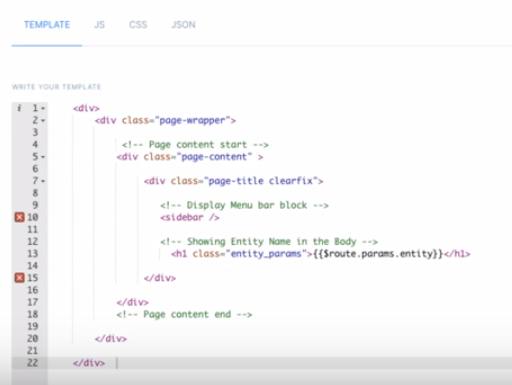
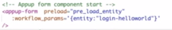
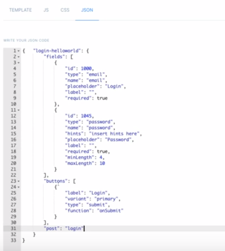

# Pages
Pages are the top level scope holders. They have a name, a URL and a template describing what to show. When you create a page, you use regular HTML as well as custom defined **Blocks** to populate it according to your needs.

In order to create a page, select **Pages** from your dashboard and click Add Pages button.


---

You will be asked for a name, a URL and page contents.


## Sections
There are four different code sections you can include in your pages. A template, Javascript code, CSS rules and global JSON objects.

### Template
Templates are the main HTML that represents your pages. It supports all the vanilla HTML elements in your disposal. Moreover, it has the capability to inject [Blocks](/docs/frontend/blocks) which allows you to reuse existing components multiple times with only copying a single line of code.


#### Routing
By customizing the page URL, you configure dynamic routing as well as use the route parameters right inside your page.

Form your URL like `/path/to/page/:param1/:param2` to be able to access `param1` or `param2` inside your template. Once you configure the URL, your custom parameters will be available to be used in your template with  syntax. You will be able to run custom logic with [Handlers](/docs/frontend/handlers) using these route parameters.



### Javascript
You can include custom Javascript code, scoped at the page level to incorporate any Javascript tooling of your preference. The functions included in this section will be globally available for all components throughout your page.


### CSS
Custom CSS or frontend frameworks can also be loaded in your page by including the rules inside CSS section. The rules written here is available to all HTML elements as well as the custom javascript you include. This is the perfect place for creating generic themes in your page.


### JSON
Chances are you are going to need global customization parameters which will effect your Javascript logic and custom components. In this case, JSON section is the tool for you. Whatever written in this section will be available in Javascript via `window.UIJSON`.


---

You will also be able to use these JSON values to automatically populate smart [Form](./#form) elements.

## Components
Appup provides many ready to use components for handling complex but very common tasks such as creating and validating forms. You can utilize these components in your pages to create sophisticated controls in your UI.

### Form
Appup forms a unique and easy to use way to quickly create dynamic, self validating forms. They configured via global JSON and allows you to include many smart input elements such as text, number, dropdowns and buttons.

You use an Appup form by including the following code in your template.



---

Then you configure what kind of inputs you want to show via global JSON.



---

The name you provide to `:workflow-params` should match the JSON key of your form configuration. Once your configuration is complete, you will use `preload` to set a [Handler](/docs/frontend/handlers) to finalize your form logic.

```javascript
// TODO : code needed from example videos
```

---

#### Form Configuration
You can configure your forms with CSS classes, code executing computationals, condition checking conditionals and dropdowns populated via remote AJAX calls.

##### Classes
```json
// TODO : code needed from example videos
```

##### Computational
```json
// TODO : code needed from example videos
```

##### Conditional
```json
// TODO : code needed from example videos
```

##### Dynamic Dropdowns
```json
// TODO : code needed from example videos
```

### Collections
**TODO : I need to access example pages to be able to write these.**

#### Table (also v-for)
**TODO : I need to access example pages to be able to write these.**

#### Card (also v-if)
**TODO : I need to access example pages to be able to write these.**

#### Card with Sort Key
**TODO : I need to access example pages to be able to write these.**

#### Card with Search (Events)
**TODO : I need to access example pages to be able to write these.**

#### Card with Execute Workflow (Delete example)
**TODO : I need to access example pages to be able to write these.**

## Preview
You can preview a page by clicking the corresponding ... inside your pages dashboard.


