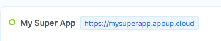

# CNAME
Each cloud you create is defined with a domain name provided under `<cloud-name>.appup.cloud`. You can choose to wrap this with a custom name representing your project or company. Simply copy the URL (without the `https://` part) in your cloud dashboard into your DNS configuration as a CNAME record.

To setup a CNAME record, please refer to your name provider or DNS host documentation.

* [AWS Route 53](https://docs.aws.amazon.com/Route53/latest/DeveloperGuide/resource-record-sets-values-alias.html)
* [Gooogle Cloude DNS](https://cloud.google.com/dns/quickstart)
* [Name.com CNAME](https://www.name.com/support/articles/115004895548-Adding-a-CNAME-Record)
